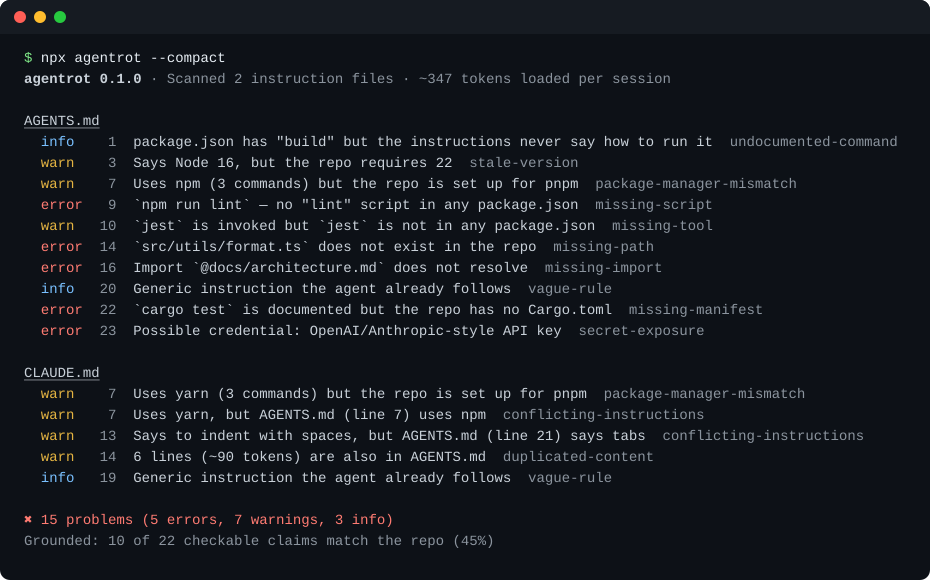

<h1 align="center">agentrot</h1>

<p align="center"><b>Your <code>AGENTS.md</code> says <code>npm run lint</code>. Your repo has no lint script.<br>agentrot finds every claim your agent instructions make that is no longer true.</b></p>

<p align="center">
  <a href="https://github.com/Nithinfgs/agentrot/actions/workflows/ci.yml"></a>
  <a href="LICENSE"></a>
  
  
</p>

<p align="center"></p>

```bash
npx github:Nithinfgs/agentrot        # run it in any repo that has an AGENTS.md or CLAUDE.md
```

No API key, no network, no LLM. It reads your instruction files and checks them against the repo.

## The 20-second version

Coding agents read `AGENTS.md`, `CLAUDE.md`, `GEMINI.md`, Cursor rules and similar files at the start of every session, and believe them. Those files are written once and then rot: scripts get renamed, directories move, the team switches from npm to pnpm, someone pastes a template from another project. The agent follows the stale instruction anyway, and you pay for it in wrong commands, second lockfiles and wasted turns.

Format linters check that these files are *well-formed*. agentrot checks that they are *true*: it extracts every file path, `@import`, script, make target, tool, and version the file mentions and verifies it against `package.json`, lockfiles, the Makefile, `.nvmrc` and the file tree.

## Why this exists

- Agent instruction files are now a standard part of repos, and most are hand-written and never re-verified.
- The common failure is not a syntax error, it is a confident, outdated claim.
- Context is paid for on every session, so duplicated and bloated instruction files cost real tokens.
- A deterministic check belongs in CI, next to the linter, not in another prompt.

## Quick start

```bash
# one-off run in the current repo
npx github:Nithinfgs/agentrot

# another directory, machine-readable
npx github:Nithinfgs/agentrot ../my-project --format json
```

Once the package is on the npm registry this becomes `npx agentrot`. Until then the GitHub form above works and builds on first use (Node 18+).

Try it on the bundled example, a deliberately rotted repo:

```bash
git clone https://github.com/Nithinfgs/agentrot && cd agentrot
npm install && npm run build
node dist/src/cli.js examples/rotted-repo
```

Exit code is `1` when an error is found, so it works as a CI gate. [Full output of the example](docs/assets/demo-full.svg).

## What it checks

| Rule | Severity | Catches |
|------|----------|---------|
| `missing-path` | error / warn | A file or directory in backticks or a relative link that does not exist (suggests the moved file when it can) |
| `missing-import` | error | `@docs/file.md` imports that do not resolve, so context is silently lost |
| `missing-script` | error | `npm run x`, `pnpm x`, `yarn x`, `make x`, `just x` where `x` is not defined |
| `missing-manifest` | error | `cargo test`, `go test`, `mvn` … documented in a repo with no `Cargo.toml`, `go.mod`, `pom.xml` (copy-pasted template) |
| `package-manager-mismatch` | warn | Instructions say `npm install`, the lockfile says pnpm |
| `missing-tool` | warn | `jest`, `eslint`, `pytest`, `ruff` … invoked but not a dependency |
| `stale-version` | warn | "Requires Node 16" while `.nvmrc` says 22; Python version likewise |
| `conflicting-instructions` | warn | `CLAUDE.md` says yarn, `AGENTS.md` says npm; tabs vs spaces |
| `duplicated-content` | warn | The same lines in two files, loaded twice per session |
| `context-bloat` | warn | A file, or the root files together, over a token budget |
| `secret-exposure` | error | API keys, tokens or private keys pasted into an instruction file |
| `vague-rule` | info | "Write clean code", "follow best practices": filler that costs tokens and changes nothing |
| `undocumented-command` | info | `package.json` has `test`/`lint`/`build` but no instruction file says how to run it |

`agentrot --rules` prints this list. The summary also reports how many of the checkable claims matched the repo ("Grounded: 28 of 28").

Files scanned: `AGENTS.md`, `CLAUDE.md`, `CLAUDE.local.md`, `GEMINI.md`, `CONVENTIONS.md`, `.cursorrules`, `.windsurfrules`, `.cursor/rules/*.mdc`, `.github/copilot-instructions.md`, `.github/instructions/*.md`, and `SKILL.md` (secrets and imports only, since skills reference bundled resources). Byte-identical files and symlinks are reported once.

## Use it in CI

GitHub Actions, with inline annotations on the offending lines:

```yaml
- uses: actions/checkout@v4
- uses: Nithinfgs/agentrot@v0.1.0
  with:
    fail-on: error        # error | warn | info | none
```

Or directly:

```yaml
- run: npx --yes github:Nithinfgs/agentrot --format github
```

Pre-commit (`.pre-commit-config.yaml`):

```yaml
- repo: local
  hooks:
    - id: agentrot
      name: agentrot
      entry: npx --yes github:Nithinfgs/agentrot
      language: system
      files: '(AGENTS|CLAUDE|GEMINI)\.md$|\.cursor/rules/'
      pass_filenames: false
```

## Options

```
agentrot [dir] [options]

  -f, --format <fmt>   text (default) | json | github | markdown
      --fail-on <lvl>  error (default) | warn | info | none
  -c, --config <file>  config file (default: .agentrotrc.json in dir)
      --compact        one line per finding
      --no-color
      --rules          list all rules
```

## Configuration

`.agentrotrc.json` (all keys optional):

```json
{
  "ignore": ["vague-rule"],
  "ignorePaths": ["examples/**", "vendor/**"],
  "maxTokens": 3000,
  "maxTotalTokens": 6000,
  "files": ["docs/agent-guide.md"],
  "checkSkills": false
}
```

Suppress a single finding in the file itself:

```md
<!-- agentrot-ignore missing-path -->
Generated at build time: `out/report.html`
```

Heuristics that skip a line on purpose: negations ("never use `npm`"), examples ("e.g."), creation ("create `src/new.ts`"), hedges ("if exists"), paths covered by `.gitignore`, and `owner/repo`-style strings whose first segment is not a real directory.

## How it works

```
repo ──► discover ──► parse ──► rules ──► report
         instruction  markdown   13 pure    text / json /
         files        → claims   functions  github / markdown
              │                      ▲
              └──► project facts ────┘
                   package.json, lockfiles, Makefile, justfile,
                   .nvmrc, pyproject, file index
```

1. **Discover** instruction files and collapse identical ones.
2. **Parse** Markdown into inline code, shell command lines (from fenced blocks and inline code), links and `@imports`, keeping line numbers.
3. **Project facts** are read once: scripts and dependencies from every `package.json`, the package manager from `packageManager` or the lockfile, make targets, just recipes, required Node/Python versions, `.gitignore`, and an index of repo paths.
4. **Rules** compare claims with facts. Each is a small pure function in [`src/rules`](src/rules).
5. **Report** sorted findings, plus the token footprint of the root files (a ~4 chars/token estimate, not billing-grade).

## Limitations

- It checks facts that can be checked mechanically. It cannot tell you whether the *advice* is good.
- Heuristics favor missing a problem over crying wolf, but they will still occasionally flag something intentional. Use `agentrot-ignore` or `ignore` for those. Please open an issue with the line that was wrongly flagged.
- Command checks cover the npm family, make, just, cargo, go, a few Python and JS tools. More ecosystems are welcome as contributions.
- Token counts are estimates.

## Roadmap

- [ ] `--fix` for safe rewrites (package manager, renamed paths)
- [ ] Monorepo-aware script resolution per workspace
- [ ] More ecosystems: Gradle tasks, `uv`/`poetry` scripts, Taskfile
- [ ] Publish to npm and a Homebrew tap
- [ ] SARIF output for GitHub code scanning

## Contributing

Bug reports with a minimal instruction file are the most valuable contribution. See [CONTRIBUTING.md](CONTRIBUTING.md). A new rule is one file in `src/rules/` plus tests.

## License

[MIT](LICENSE)
